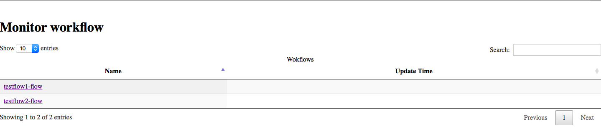
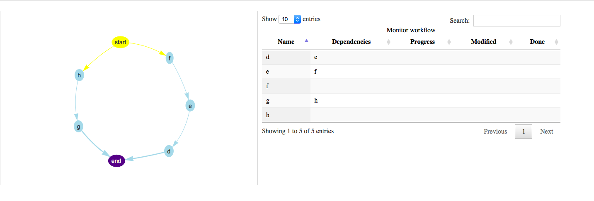

# Workflow Management

Cloudmesh includes a simple tool for managing workflows. A cloudmesh
*workflow* is a set of Python functions (that we call tasks or nodes)
that form the workflow. The tasks can have dependencies.  Thus, some
may be run in sequence and some in parallel. You can visualize your
workflows, including the monitoring the current status of the tasks,
and the dependency network between them.

## Getting Started

To use this tool, you'll need to already have cloudmesh
installed. Follow the instructions at the cloudmesh repository located
here. This tool relies on MongoDB within the cloudmesh command, so
you'll need to have Mongo up and running on your local machine.

To install this tool within cloudmesh, clone this repository and run 

```bash
$ pip install -e .
```


The commands then should be available by calling the flow commands via
`cms`. 

The first thing you have to do is to start the cloudmesh database in which we
store information about the tasks as well as their status throughout the
execution. If you have not yet started it please execute:

```bash
$ cms admin mongo start
```


Now you can test that the installation went well by calling

```bash
$ cms flow list
```

to list your current tasks. The command should complete correctly but
output nothing if you have now prior workflows integrated.


### Adding Tasks

There are several ways to add tasks to your workflow. The simplest is
just to call 

```bash
$ cms flow node add TASKNAME
```

For example, to add a task named `a` call

```bash
cms flow node add a
```

This creates a reference to the task
in the database, and adds the task to your default workflow, which is
named `workflow`

By default, all tasks are run in parallel. Typically, you'll have
multiple tasks that you need to run, some in sequence some in
parallel. To add tasks `a`, `b`, and `c`, where `a` and `b` can be run
in parallel but `c` depends on `a`, execute the following sequence:

```bash
$ cms flow node add a
$ cms flow node add b
$ cms flow node add c
$ cms flow edge add c a
```

This creates the 3 above nodes, and then adds the dependency. You can
check that the nodes were added successfully by running

```bash
$ cms flow list
```
Your output should look similar to this:

```bash
Node "a" dependecies []
Node "b" dependencies []
Node "c" dependencies ["a"]

```

#### Multiple Workflows

Many times a user wants to have several different workflows
defined. You can manage several workflows by passing the `--flowname`
parameter to the `cms flow command`. For example, to add a new node in
the workflow `workflow2`, run

```bash
$ cms flow node add d --flowname=workflow2
```


Now you will have 2 workflows, the default one with the nodes we added
earlier, and the flow `workflow2`. You can see the different results
by running the list command on each

```bash
$ cms flow list
$ cms flow list --flowname=workflow2
```

### Adding A Complete Flow

While this process works for smaller workflows, it can be tedious to
add 10 or 15 tasks via the command line. You can add a flow by
defining a *flowstring*, which specifies many tasks and their
dependencies all at once.

A flowstring is a single string with a list of tasks, separated by
either a semicolon (;) or a double pipe (||). The semicolon indicates
sequential dependency and the pipe indicates parallel. A sample
flowstring for the flow we defined above is

`"a;c||b"`

Node `a` is joined sequentially with node `c` and in parallel with
node `b`.

#### Adding a Flow String
Currently only supported in a YAML file.

#### Adding a Flow YAML Definition
You can also specify a flow in a YAML file. The file must have two properties, flowstring and flowname. This allows you to add an entire flow at once unders a specfic name. See the examples directory for details. 

## Running Flows
Workflows nodes correspond to Python functions that are attached to specific workflow classes. To run a workflow, you need to specify the task definitions. The easiest way to see this in action is in the [examples directory](https://github.com/cloudmesh/cloudmesh-flow/tree/master/cloudmesh/flow/example).

Defining a Workflow is simple: declare a class with one method for each node, and have the class inherit from the BaseWorkFlow base class. The method names should correspond to your node names, for example if you node is named "a" you must define a method named `a()` At the bottom of your file, copy the _entry point code_ that is listed on each of the example files:

```python

if __name__ == "__main__":
    Flow = MyFlow(sys.argv[0])
    Flow.runCommand(sys.argv[1])
    
```

This makes it so the flow runner is able to call your methods. Anything you return at the end of your function will be inserted into the database as the result of running that node. You should return a dict, which will be accessible via the `result` field in the db. Note that your filename should be of the form `$flowname-flow.py`. This makes it so the result parser can grab the result of your workflow methods and insert them into the database corresponding to the current run of $flowname.

## Visualizing

The package `cloudmesh.flow.visualize` visualizes the workflows that
have been created by the `cloudmesh.flow` package.  This package
consists of a rest s ervice which essentially provides the following
two methods:

* `/list` method which lists the names of all the workflows
* `/monitor/{workflowname}` method which visualized the workflow named
  by `{workflowname}`

### Start the visualization service

To start the visualization service run the following command:

```bash
$ cms flow visualize start
```
The visualization rest service will then be available at the address 

http://127.0.0.1:8080/flow/

To stop the rest service run the follwoing command:

```bash
$ cms flow visualize stop
```

At the page `http://127.0.0.1:8080/flow/` you can find the list of all the submitted workflows. 

{#fig:flow-visualize-home}

By
selecting a workflow you can view a visualization of the workflow.

{#fig:flow-visualize-workflow}

A node in a visualization has a color. The color represents the status
of the task associated with the node. If the task is pending for
execution, its color will be `blue` otherwise the color is `green`. On the right you can view the graph information including the 
name of the nodes and the dependencies between nodes. The features `progress`, `modified time` and `done` are added to the visualization package but currently these data 
are not present in the flow database
 or if present the data-access class does not retrieve them.


## Refernces

* This work is influenced by <https://github.com/cloudmesh/workflow>
